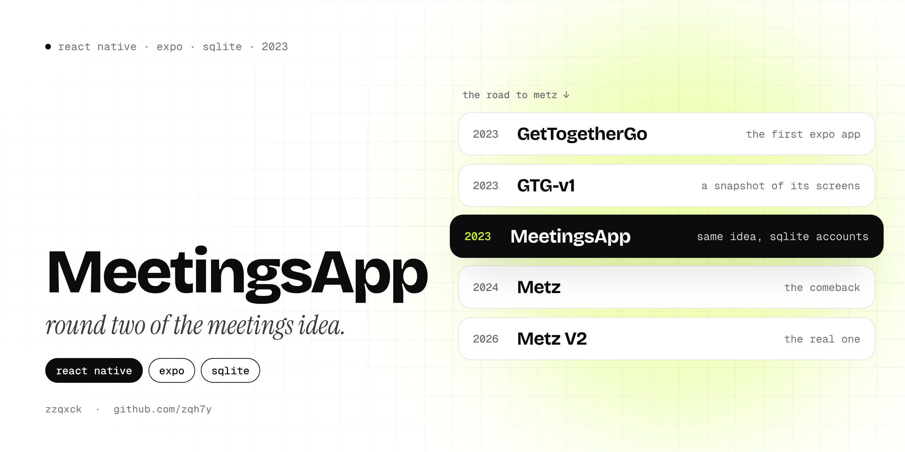

  

  
  
  

# MeetingsApp

MeetingsApp is the second round of my meetings idea, built right after [GetTogetherGo](https://github.com/zqh7y/GetTogetherGo) in 2023. The goal was the same: an app where you find meetings around you on a map, join them, and talk to the people going. Inside the app it's called **MeetApp**.

Compared to GetTogetherGo, this version focused on making it feel like a real product:

- **Accounts.** Signing up creates a user in a local SQLite database (a `users` table with unique usernames). The log in screen blocks insulting usernames, but it doesn't check the database yet.
- **Find a meeting.** A search screen with a filter and recommended meetings, and a join button that confirms you're in.
- **Rules for creating meetings.** Title up to 30 characters, description up to 500, a location from the map, and clear rules (delete it when it's over, fake meetings get you banned).
- **A first try at a backend.** The profile screen sends updates to a PHP endpoint. The PHP side isn't in this repo, and a proper backend didn't happen until [Metz V2](https://github.com/zqh7y/MetzV2).

The look is the same as GetTogetherGo, so the [GetTogetherGo README](https://github.com/zqh7y/GetTogetherGo) has screenshots of what these screens look like.

## What's in the repo

| Path | What it is |
|---|---|
| `js/Log/` | Welcome, log in and sign up (with SQLite) |
| `js/Meeting/` | Map, create a meeting, find a meeting, notes |
| `js/Social/` | Home, chat, groups, profile and posts |
| `*.jsx` in the root | Flat copies of the same screens |
| `meetDatabase.sql` | The SQL for the users table |
| `app.json` | Expo config (dark UI, camera and storage permissions) |

This is a code snapshot rather than a runnable project: `package.json` and the images and fonts aren't committed. If you want to run this generation of the app, use the [`main` branch of GetTogetherGo](https://github.com/zqh7y/GetTogetherGo/tree/main), which has the full project.

## Where it went next

| Year | Version |
|---|---|
| 2023 | [GetTogetherGo](https://github.com/zqh7y/GetTogetherGo), the first Expo app |
| 2023 | **MeetingsApp**, this repo |
| 2024 | [Metz](https://github.com/zqh7y/Metz), the comeback with a night-mode map |
| 2026 | [Metz V2](https://github.com/zqh7y/MetzV2), the real app with an API, a database and Metz Host |

---

  Made by <b>zzqxck</b> · <a href="https://zqh7y.github.io/Portfolio/">portfolio</a> · <a href="https://github.com/zqh7y">more projects</a>

